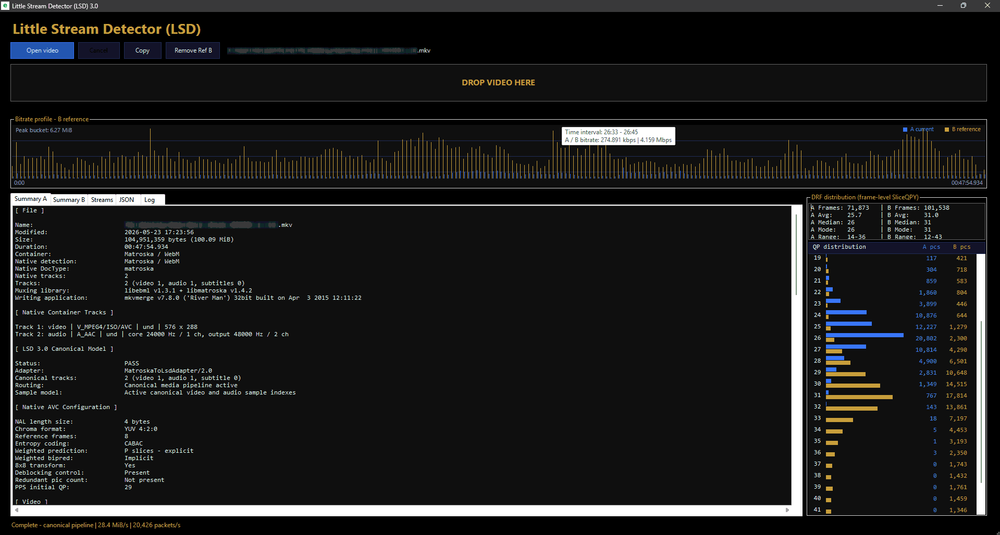

# Little Stream Detector (LSD) 1.0

Little Stream Detector is a lightweight and portable tool for fast video file analysis without decoding or transcoding.

## Features

- Native Matroska and WebM parsing
- H.264 / AVC and H.265 / HEVC analysis
- I, P, and B picture detection
- GOP structure and bitrate profile
- Native frame-level HEVC SliceQPY / DRF analysis
- DRF distribution histogram
- Video and audio stream information
- Summary, Streams, JSON, and Log views
- File selection and drag-and-drop support

## Zero Dependencies

LSD does not use FFmpeg, FFprobe, MediaInfo, or any other external multimedia tool.

Video files are only read and analyzed. They are never decoded, modified, or transcoded.

## Screenshot

## Usage

1. Run `LSD.exe`.
2. Drag a video file into the application window, or click **Open video**.
3. Wait for the native analysis to complete.
4. Use **Copy** to copy the generated report.

No installation or administrator privileges are required.

## Running the PowerShell source

If `LSD.ps1` was downloaded from the Internet, Windows may block it.

Right-click `LSD.ps1`, select **Properties**, check **Unblock**, and click **Apply**. The script can then be started using **Run with PowerShell**.

Alternatively, unblock the downloaded ZIP file before extracting it. This prevents the extracted files from inheriting the Internet security marker.

This step is not required for the compiled executable.

## System Requirements

- Windows 10 or Windows 11
- 64-bit Windows recommended
